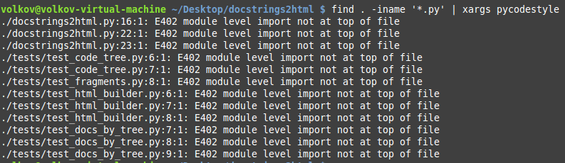
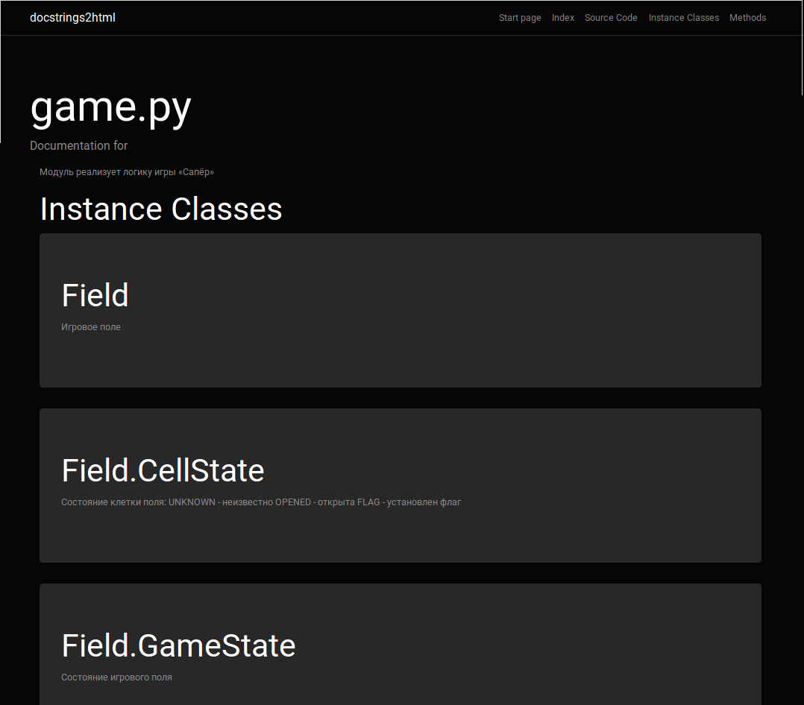
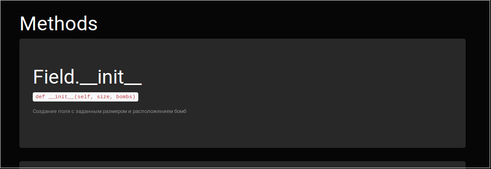
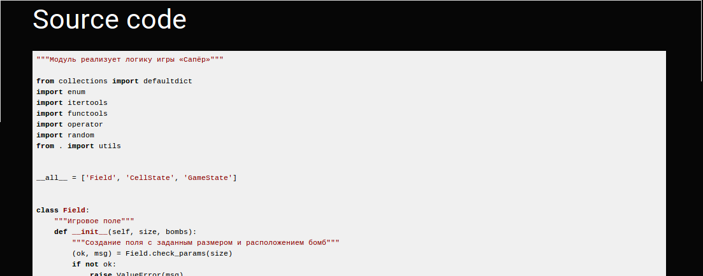

# docstrings2html
## What already does

- Build HTML documentation by a separate file;
- Build HTML documentation by several files;
- Build documentation for the package;
- All files are stored in a separate directory, which you can specify;
- Each file is linked to other different links, i.e. good navigation through the documentation;
- One template written using the Bootstrap web framework is used to display all HTML files;
- Within each HTML file are relative paths to the CSS and JS files folder;
- The source code can also be transferred to `stdin', in which case the generated HTML code will simply be output in `stdout';
- There are tests on the basic logic of the programme (code parsing, building a tree). There are many tests;
- Works equally well on both Windows and Linux;
- By key --exclude-special you can filter methods with two underscores at the beginning. For example, `__str__()` or `__special()`. In this case, `__init__()` will be added exactly to the documentation;

## Dependencies
- Python 3;
- [Yattag](http://www.yattag.org/) - library for generating HTML or XML in a pythonic way;

## Состав

- Working logic: `architecture/`
- CSS and JS: `template/`
- Entry point: `docstrings2html.py`
- Tests: `tests/`

Many modules (`architecture/*` except `html_builder.py`) have tests and can be found in `/tests`. The line coverage is 89%

You can use `runtest.sh` (you need `bash`, `coverage3`) to run the tests. 

```
Name                           Stmts   Miss  Cover   Missing
------------------------------------------------------------
architecture/code_tree.py         54     11    80%   15-17, 32, 36-38, 43, 57-63, 66
architecture/docs_by_tree.py     129      9    93%   14, 18, 28, 42, 44, 63, 173, 176, 263
architecture/fragments.py         55      5    91%   17, 73-76
architecture/html_builder.py     159     47    70%   12, 30, 114-115, 167-230
------------------------------------------------------------
TOTAL                            397     72    86%
```



## How it works
The input to the utility is either a source file or several files, or a package.
Each file with code on python (`*.py`) is broken down into pieces (module `architecture/fragments.py`). They can be nested, follow each other and so on (but not overlapping).

Then a tree is built on these fragments (module `architecture/code_tree.py`). This makes it easy to identify which classes and functions are nested in each other.

After that, the code is analyzed once again by the built tree, and for each function and class the descendants are written, docstrings and some other information are memorised (module `architecture/docs_by_tree.py`).

At the end, the collected information for the module is generated in HTML code (module `architecture/html_builder.py`). When working with HTML, the Bootstrap web framework and the Yattag package for Python are used.

The structure of the project's directories is copied at the very end, and html files (module `architecture/html_builder.py`) are saved in the respective directories in place of the modules, each file describing strictly one module. In each directory, an index.html is created, which records which modules are in that directory.

## How to run

Help: `./docstring2html.py --help`

Example:

```
./docstrings2html.py -f test_file1.py test_file2.py
```

## Screenshots








